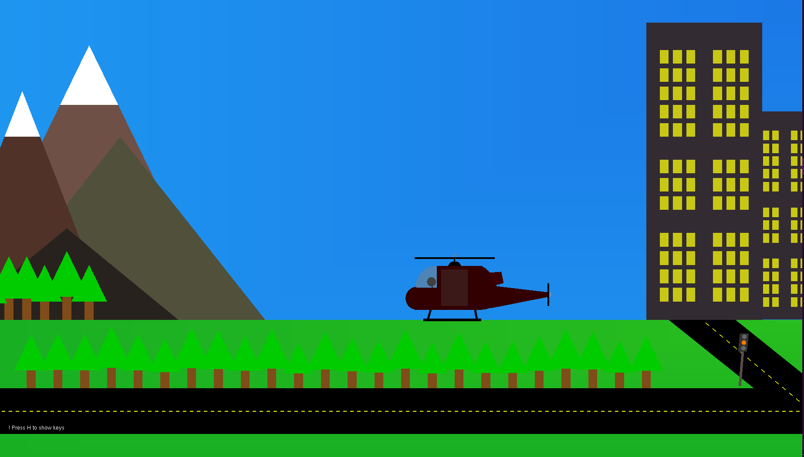
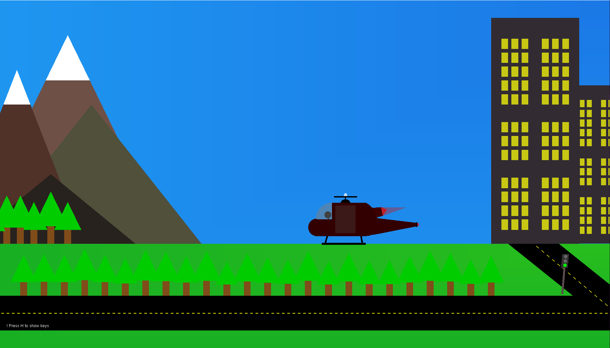
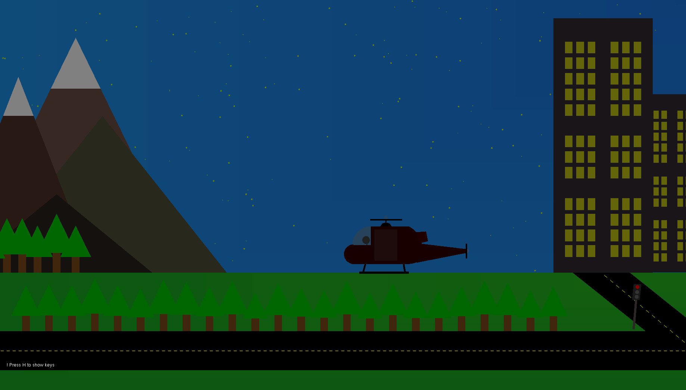

<body>
<header>
        <h1>Chopper Simulator</h1>
    </header>
    

        <h2>Description</h2>
        
Welcome to Chopper Simulator! This project is a simple 2D helicopter simulation game built using HTML, CSS, and JavaScript. It allows players to control a helicopter and fly around in a 2D environment. The simulator includes features such as day and night mode, variable speed control, rotation control, movement control, sound effects, and a user-friendly interface.

        <h2>Features</h2>
        <ul>
            <li>Simple 2D helicopter simulation game.</li>
            <li>Day and night mode.</li>
            <li>Variable speed control using the Shift key.</li>
            <li>Rotation control using the Q, W, and E keys.</li>
            <li>Movement control using arrow keys.</li>
            <li>Realistic sound effects.</li>
            <li>User-friendly interface.</li>
        </ul>
        <h2>Preview</h2>
        <h3>View</h3>
        <h6>Playing some functionalies</h6>
        
        <h3>Idle</h3>
        <h6>chopper engine is off</h6>
        
        <h3>Engine on</h3>
        <h6>chopper engine is on and its ready to fly</h6>
        
        <h3>Night mode</h3>
        <h6>Night mode</h6>
        
        <h2>Usage</h2>
        
To play the game, simply open the <code>index.html</code> file in your web browser. Use the Shift key to control speed, Q/W/E keys to rotate, and arrow keys to move the helicopter.

        <h2>Contributing</h2>
        
Contributions are welcome! If you'd like to contribute to this project, please fork the repository and submit a pull request with your changes.

        <h2>License</h2>
        
This project is licensed under the MIT License - see the <a href="LICENSE">LICENSE</a> file for details.

        <h2>Contact</h2>
        
If you have any questions or suggestions, feel free to contact the project maintainer at <a href="mailto:mhamadtahir2003@gmail.com">mhamadtahir2003@gmail.com</a>.

        
visite my <a href="https://m7amad-t.web.app">protfolio</a>.

    

</body>
